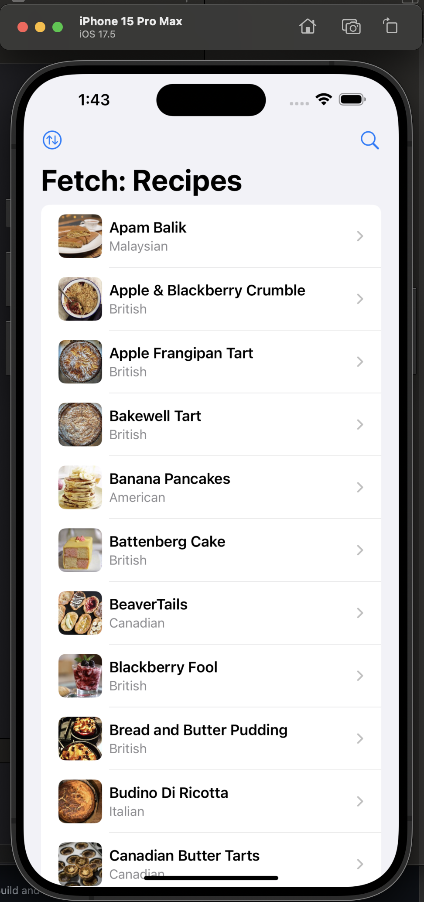
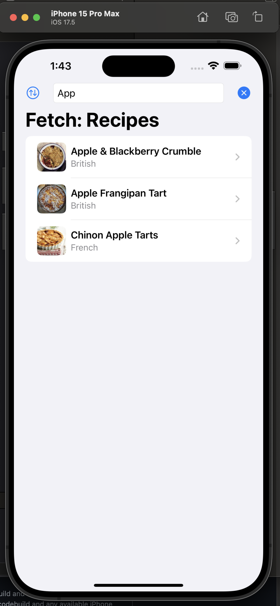
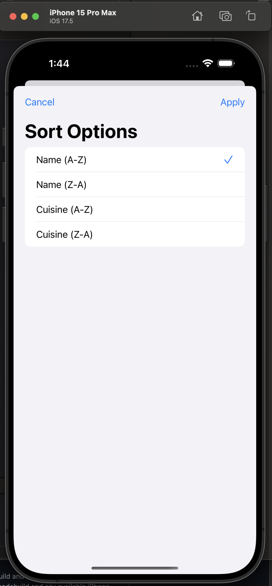
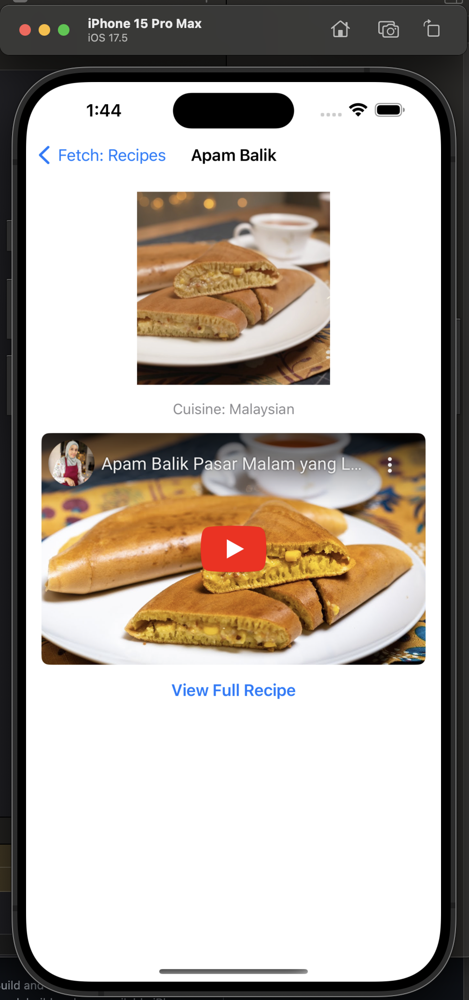

### Summary:
This project follows a simple MVVM pattern, implementing a RESTful API that delivers recipe information in order to display a list of possible recipes a user might make. In addition, a user may sort the recipes by name or cuisine, either alphabetically or in reverse alphabetical order. Also, the user can enter some search text to filter the results. Lastly, tapping any recipe in the list will present a detail view with an embedded youtube video and link to the tutorial source url.

  
   

  
   

### Focus Areas: What specific areas of the project did you prioritize? Why did you choose to focus on these areas?
I focused a lot on ensuring I created views at an appropriate level of abstraction, where substantial subcomponents of a particular view are put into a new file/struct while avoiding making an egregious amount of files to this end. I also put some effort into ensuring the networking, image caching, and view model functionalities had robust unit tests for their core functions. Lastly, while I did not spend substantial time on aesthetic refinement, I did try to ensure the layout reflects that of a typical modern app (albeit a very simple one)

### Time Spent: Approximately how long did you spend working on this project? How did you allocate your time?
I spent about 4 hours total. The breakdown was roughly as follows:
- 5 minutes: Project and repository initialization
- 60 minutes: Writing core files for to meet base requirements except testing (RecipeListView and RecipeListItem, plus the data model, API client, ImageCache utility and view model)
- 60 minutes: Adding additional features like search, sort and detail screen, as well as cleaning up the rest of the project a bit.
- 60 minutes: Researching unit tests in xcode to refresh myself on the basics of this skill (Ally did not have us write unit tests as developers. Our QA engineers handled all test writing, so I honestly have little experience here)
- 30 minutes: Writing tests for core functions of view model, API client, and ImageCache utility.
- 25 minutes: Writing up this README

### Trade-offs and Decisions: Did you make any significant trade-offs in your approach?
I'm not honestly sure how to answer this given there were no constraints on time and also no dependencies were allowed. If there were time constraints I would have had to make some challenging decisions about what to prioritize developing, but given that there were none I don't feel I had to make any substantial trade-offs. Maybe I can say that burn out on writing this short project contributed to the weak part mentioned below.

### Weakest Part of the Project: What do you think is the weakest part of your project?
Probably the ImageCache utility, I took a very simplistic approach to this of creating a singleton type class with a memoryCache field which was a dictionary of strings to UIImage data. While this is probably plenty functional for this very small application, the bigger issue is that I didn't even implement any size limit to the cache. Again, probably not an issue in this scenario, but I wanted to mention that I'm aware of it at least.

### Additional Information: Is there anything else we should know? Feel free to share any insights or constraints you encountered.
As I mention above, I am woefully inexperienced with writing unit tests, so I'd be curious to hear feedback about whether the tests I wrote have a reasonable coverage and are testing the appropriate functionalities.
